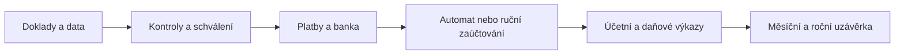

# MyÚčto.cz

[](LICENCE.txt)
[](https://www.php.net/)
[](https://mariadb.org/)
[](https://vuejs.org/)
[](https://github.com/radekhulan/myucto/pkgs/container/myucto)

> **MyÚčto.cz je nástupcem open-source systému
> [MyInvoice](https://github.com/radekhulan/myinvoice), známého také z
> [myinvoice.cz](https://myinvoice.cz/). Veškeré funkce MyInvoice zůstávají
> v MyÚčto navždy zdarma a plně použitelné i bez aktivní licence.**
>
> Komerční licence přidává podvojné účetnictví, účetní nástroje a uzávěrky,
> sklad a napojení e-shopu, evidenci majetku, EPO podání a archív a rozšířené
> opravy DPH (§ 74b, § 43, § 46 a § 79). Celý rozsah lze prvních 60 dní
> bezplatně vyzkoušet.

### Účetnictví od dokladu po uzávěrku. Vaše data, vaše servery.

**MyÚčto.cz vede firmu celým účetním cyklem — od prvního dokladu a bankovní
transakce až po daňovou a účetní uzávěrku.** Doklad pořídíte jednou a systém ho
provede přes platbu, zaúčtování, deník, výkazy DPH i závěrku. AI vytěží přijaté
faktury a připraví návrhy, o zaúčtování ale vždy rozhoduje účetní. A protože je
řešení self-hosted, aplikace, databáze i doklady zůstávají na **vaší
infrastruktuře** — do cloudu nic neodchází.

🌐 [MyÚčto.cz](https://myucto.cz/) ·
📖 [Online manuál](https://myucto.cz/manual/) ·
🏢 [MyWebdesign.cz s.r.o.](https://mywebdesign.cz/)


---

## Proč MyÚčto

- **Data patří vám.** Kompletně self-hosted (Docker, IIS nebo Apache). Aplikace,
  databáze, doklady i zálohy zůstávají ve vaší infrastruktuře — žádný SaaS,
  žádné přesouvání účetnictví k třetí straně.
- **Jeden provázaný cyklus, ne izolované moduly.** Fakturace, nákup, banka,
  pokladna, sklad, majetek, podvojné účetnictví, daňová evidence, DPH i daň
  z příjmů sdílejí jedna data. Údaj z dokladu doteče až do závěrky.
- **AI vytěžuje, člověk rozhoduje.** AI přečte přijaté faktury a navrhne
  kontaci, ale AI návrhy nelze hromadně schválit a nikdy se nezaúčtují bez
  potvrzení účetní.
- **Automat s pravidly a auditní stopou.** Deterministická automatika zaúčtuje
  jen jednoznačné operace v otevřeném období a do nastaveného limitu. Nejasné
  případy odloží ke kontrole a u každého kroku zůstává dohledatelná historie.
- **Více firem v jedné instalaci.** Účetní kancelář vede libovolný počet
  oddělených firemních agend s vlastními číselnými řadami, účty i brandingem a
  přepíná mezi nimi bez směšování dat.
- **Klientský portál a otevřený základ.** Klient předává doklady a sleduje jejich
  stav ve vlastním portálu odděleném od administrace. Základ produktu je
  postavený na open-source projektu [MyInvoice](https://github.com/radekhulan/myinvoice).

## Přehled funkcí

Každý modul má vlastní kapitolu manuálu — odkazy vedou na detail.

| Modul | Co pokrývá |
|---|---|
| **Prodej a pohledávky** | Faktury, zálohy, opravné doklady, pravidelná fakturace, více měn, DPH/reverse charge/OSS, PDF s QR platbou, upomínky, saldo a cash-flow. |
| **Nákup a AI zpracování** | Přijaté faktury a účtenky, import ISDOC/Pohoda XML/PDF, [AI extrakce](manual/46_Automat.md), kontrola součtů a DPH, návrh nákladového účtu s povinným potvrzením. |
| **Banka a pokladna** | Více účtů a měn, import výpisů, automatické párování podle VS a částky, částečné úhrady, kurzové rozdíly, pokladní doklady. |
| **Podvojné účetnictví** | Účtový rozvrh, předkontace, [automat účtování](manual/46_Automat.md), účetní deník, hlavní kniha, předvaha, rozvaha, výsledovka, saldokonto. |
| **Daně a evidence** | [Přiznání DPH, kontrolní a souhrnné hlášení](manual/36_Vykazy_DPH.md), [režim OSS](manual/40_OSS.md), [DPFO/DPPO](manual/38_Dan_z_prijmu.md), [daňová evidence](manual/71_Danova_evidence.md), archiv XML a asistované i přímé podání přes EPO API. |
| **Uzávěrka** | [Účetní období](manual/68_Uzaverka.md), závěrková mapa K1–K10, [kontroly a inventarizace](manual/60_Ucetni_kontroly_a_inventarizace.md), odpisy, časové rozlišení, závěrkový balíček. |
| **Majetek a sklad** | Karty majetku a odpisy, skladové karty a pohyby, inventura, automatická výdejka při fakturaci, napojení e-shopu. |
| **Reporting a portál** | Přehled tržeb, nákladů, pohledávek a cash-flow, [klientský portál](manual/43_Pruvodce_ucetniho.md), responzivní rozhraní, role admin / účetní / klient / pouze pro čtení. |
| **Více firem a API** | [Neomezený počet firemních agend](manual/72_Multi_supplier.md) v jedné instalaci, [REST API v1](manual/78_API.md) s osobními tokeny a scopes. |


> MyÚčto.cz připravuje a kontroluje podklady, ale **nenahrazuje odborný úsudek
> účetní ani daňového poradce.** Ostré přímé podání do EPO vyžaduje samostatné
> potvrzení oprávněného uživatele; v asistovaném režimu dokončuje kontrolu a
> odeslání uživatel přímo na portálu Finanční správy.

### Kontrola místo slepé automatizace

Automat je systém pravidel, ne neprůhledné „AI účtování“. Položka se zaúčtuje jen
tehdy, když je výsledek jednoznačný, období otevřené, částka pod limitem a
nechybí předkontace. Neznámá měna, nevyrovnaný zápis, uzavřené období nebo
chybějící kurz operaci zablokují a vysvětlí proč. Detail:
[Automat účtování](manual/46_Automat.md).

### EPO podání a archív

Každé vygenerované XML se uloží jako neměnný snapshot s otiskem, výsledkem
validace a auditní historií. V **Nástroje → EPO podání a archív** jsou dostupné dvě
cesty:

- **Asistované podání** předá archivovaný XML snapshot do předvyplněného
  formuláře EPO. Uživatel v něm provede kontroly, podání odešle a stažené XML
  a potvrzení přetáhne zpět do archívu; dokumentová složka se vytvoří
  automaticky.
- **Přímé podání přes EPO API** podepíše snapshot osobním kvalifikovaným
  certifikátem P12/PFX. Nejdříve lze spustit oficiální testovací režim
  `test=1`, který ověří elektronický podpis, strukturu i věcný obsah a zobrazí
  všechny vrácené problémy. Ostré podání vyžaduje nové výslovné potvrzení;
  aplikace následně archivuje odeslaný podepsaný balíček, odpověď EPO,
  doručenku i průběžné stavy zpracování.

Certifikát a jeho heslo jsou v databázi šifrované, použití je omezené na
vlastníka a výslovně povolené firemní agendy. Asistovaný a produkční přímý tok
se pro stejný snapshot vzájemně blokují, aby nevzniklo duplicitní podání;
zkušební přímý pokus asistovaný formulář neblokuje. Podrobný postup včetně
získání certifikátu, testu a práce s doručenkou popisuje
[EPO podání, archív a daňová rekonciliace](manual/70_Archiv_podani_a_rekonciliace.md).

Pro vývoj lze zapnout `epo_test` (nebo `MYINVOICE_EPO_TEST=true`). Podepsané
přímé operace pak používají zkušební portál
`https://zkus.mojedane.gov.cz`; podání, odpovědi a dodejky se archivují jako
testovací, ale daňový snapshot se neoznačí jako právně podaný. Asistované
otevření formuláře vždy používá ostrý interaktivní portál, protože samotné
předvyplnění nic neodesílá. Výchozí hodnota přímého toku je bezpečně `false`.
Automatické potvrzení testovací dodejky navíc vyžaduje explicitně povolený
SHA-256 otisk podpisového certifikátu v
`epo.test_receipt_signer_fingerprints_sha256`.

### Funkční hranice

EPO lze použít asistovaně, nebo přímo s kvalifikovaným certifikátem. Přímý test
podání nic právně neodešle a úspěšná technická validace sama nepotvrzuje věcnou
správnost přiznání. Na ostatní portály veřejné správy systém podání automaticky
neposílá. Mzdový modul je zjednodušený účetní můstek, nikoli plnohodnotný
personální a mzdový systém. Mimo rozsah zůstává výroba a kusovníky. Přehled OSVČ
pro zdravotní pojišťovny je pouze podklad. Aktuální omezení jednotlivých modulů
popisují příslušné kapitoly manuálu; daňové a účetní výstupy před finálním
použitím odborně zkontrolujte.

## Účetní cyklus na jeden pohled




## Ceník a licence

Všechny funkce původního [MyInvoice](https://github.com/radekhulan/myinvoice)
jsou dostupné **navždy zdarma a bez omezení zápisu**. Po instalaci je navíc
**60 dní zdarma a bez registrace** dostupná celá komerční nadstavba MyÚčto.
Po skončení zkušebního období se aktivuje licenčním klíčem ze zakoupeného
předplatného (v aplikaci v sekci **Aktivace**).

Tarify se liší počtem firemních agend (od jedné firmy po neomezeně, plus
Enterprise s vlastní smlouvou, integracemi a white-label). Účtuje se za
**aktivního uživatele a měsíc**; uživatelé s rolí pouze pro čtení se nepočítají
a jsou **zdarma**. **Roční platba = 12 měsíců za cenu 10.**
Aktuální ceník a nákup předplatného: [myucto.cz/#cenik](https://myucto.cz/#cenik).

**Po skončení licence** zůstává bezplatná část plně funkční včetně pořizování
a úprav dat. Nedostupná je pouze komerční nadstavba: celý **Sklad**,
**Účetnictví** a **Nástroje**, evidence majetku, EPO podání a archív a opravy
DPH podle § 74b, § 43, § 46 a § 79. Tyto funkce nelze bez aktivní licence ani
zobrazit nebo volat přes API. Jejich data zůstávají beze změny ve vlastní
databázi a po opětovné aktivaci se znovu zpřístupní.

**Kombinovaná licence:** základ vychází z MIT projektu
[MyInvoice](https://github.com/radekhulan/myinvoice); všechny jeho koncové
funkce zůstávají v MyÚčto bezplatné. Vyjmenovaná účetní nadstavba je
proprietární a dostupná formou online předplatného nebo individuální smlouvy.
Detaily upravují články 5–7 souboru
[LICENCE.txt](LICENCE.txt) ([myucto.cz/licence](https://myucto.cz/licence)) a
[obchodní podmínky](https://myucto.cz/obchodni-podminky).

**Do světa jde jen technika, ne účetnictví.** Licenční mechanismus ověřuje
platnost licence vůči serveru myucto.cz a předává výhradně technické údaje —
identifikátor instalace, licenční klíč, verzi aplikace a souhrnné počty aktivních
uživatelů a firemních agend. **Žádná účetní data ani obsah dokladů neodesílá.**


## Rychlý start

Nejrychlejší instalace používá připravený multi-arch Docker image a MariaDB.
Na Windows spusť v PowerShellu z kořene licencované distribuce:

```powershell
.\cmd\docker-ghcr.ps1
```

Na Linuxu je k dispozici `cmd/docker-ghcr.sh`. Skript vygeneruje `.env` s náhodnými
hesly, připraví `cfg.docker.php`, stáhne a spustí kontejnery a provede migrace.
Po dokončení otevři [http://localhost:8080](http://localhost:8080) — průvodce
založí administrátora, první firmu, bankovní účet a volitelná ukázková data.

**Aktualizace:**

```powershell
.\cmd\docker-update.ps1
```

Zachová persistentní volumes, obnoví image a spustí čekající migrace (na Linuxu
`cmd/docker-update.sh`). Před aktualizací vždy zálohuj. Kompletní postup:
[Quickstart](manual/02_Instalace_Quickstart.md) a [Docker](manual/03_Instalace_Docker.md).

### Nativní instalace

Podporované prostředí:

| Součást | Požadavek |
|---|---|
| PHP | 8.5+ s PDO MySQL, mbstring, OpenSSL, JSON, iconv a GD |
| Databáze | MariaDB 11.8+ |
| Web server | IIS nebo Apache (konfigurace pro oba je součástí distribuce) |
| Frontend build | Node.js 22+ a pnpm 10+ |
| Backend build | Composer 2 |
| Redis | volitelný; systém má databázový fallback |

Detailní postup konfigurace IIS/Apache, oprávnění a produkčního buildu je
v kapitole [Nativní instalace](manual/04_Instalace_Nativni.md). Databázové změny
spouštěj vždy přes `php api/bin/migrate.php`, nikdy migrační SQL ručně. Po prvním
spuštění nastav role, 2FA, číselné řady, účetní období a automatiku podle
[kontrolního seznamu](manual/05_Po_instalaci.md).

## Převod dat z MyInvoice

Existující instalaci [MyInvoice](https://www.myinvoice.cz/) přenese jediný
příkaz — uživatele a jejich přístupy k firmám, firmy, klienty, ceník, vydané
i přijaté faktury, bankovní výpisy, párování, dokumenty a zbytek databáze:

```powershell
php api/bin/MyInvoiceMigrate.php myinvoice
```

Skript si sám připraví schéma cíle, přenese data a teprve nad nimi dojede
migrace MyÚčta včetně backfillů — `migrate.php` spouštět ručně netřeba. Zvládne
prázdnou cílovou databázi i takovou, nad kterou už `migrate.php` proběhl.
Než cokoli zapíše, ověří, že má kam uložit **všechna** data zdroje; jinak
převod zastaví a vypíše, co konkrétně by se ztratilo.

Zdroj v jiném databázovém serveru nebo Docker kontejneru se zadá jako URL,
pro Docker → Docker je připravený wrapper:

```powershell
.\cmd\docker-migrate-from-myinvoice.ps1 -SourceContainer myinvoice-db-1 `
    -SourceDb myinvoice -SourceUser root -SourcePassword tajne
```

Kompletní postup včetně doúčtování historie po zapnutí podvojného účetnictví:
[Převod z MyInvoice](manual/06_Prevod_z_MyInvoice.md).

## Bezpečnost

bcrypt hesla s aplikačním pepperem, TOTP 2FA, CSRF ochrana a rate limiting,
volitelný IP allowlist, role a oprávnění po jednotlivých firmách, šifrování
citlivých integračních údajů, auditní log a izolace firemních agend napříč API,
reporty i souborovými cestami. Bezpečnostní model popisuje
[kapitola Bezpečnost](manual/76_Bezpecnost.md).

Bezpečnostní chybu **neoznamuj veřejným ticketem.** Použij kontakt na
[MyWebdesign.cz](https://mywebdesign.cz/) s předmětem `[SECURITY] MyÚčto.cz` a
postup v [SECURITY.md](SECURITY.md).

## REST API

Veřejné REST API v1 používá osobní přístupové tokeny, které lze omezit na čtení
nebo zápis, konkrétní firmu a dobu platnosti. Určené pro integrace s e-shopy,
CRM, BI a automatizačními platformami. OpenAPI specifikace:
[api/openapi.yaml](api/openapi.yaml), postup: [kapitola REST API](manual/78_API.md).

## Technologický základ

| Vrstva | Technologie |
|---|---|
| Backend | PHP 8.5, Slim 4, PHP-DI, Monolog, Guzzle |
| Frontend | Vue 3, TypeScript, Vite, Tailwind, Pinia, vue-router, vue-i18n |
| Databáze | MariaDB 11.8+ |
| PDF / e-mail | mPDF + Twig, Symfony Mailer (SMTP, DKIM) |
| API | REST API v1, OpenAPI 3.1 |
| Testy | PHPUnit, PHPStan, vue-tsc |
| Provoz | IIS, Apache nebo Docker; volitelný Redis |

## Dokumentace

Uživatelský manuál pokrývá celý pracovní cyklus v 58 kapitolách:

- [Úvod a mapa funkcí](manual/01_Uvod.md)
- [Převod dat z MyInvoice](manual/06_Prevod_z_MyInvoice.md)
- [Průvodce účetního](manual/43_Pruvodce_ucetniho.md)
- [Automat účtování](manual/46_Automat.md)
- [Daňové výkazy](manual/36_Vykazy_DPH.md) · [Daň z příjmů](manual/38_Dan_z_prijmu.md) · [Režim OSS](manual/40_OSS.md)
- [Kontroly a inventarizace](manual/60_Ucetni_kontroly_a_inventarizace.md) · [Uzávěrka](manual/68_Uzaverka.md)
- [Daňová evidence](manual/71_Danova_evidence.md) · [Více firem](manual/72_Multi_supplier.md)
- [Řešení problémů](manual/999_Reseni_problemu.md)

Kompletní pořadí je v [manual/INDEX.md](manual/INDEX.md).

### Struktura repozitáře

| Adresář | Obsah |
|---|---|
| `api/` | PHP backend, služby, repository, CLI a PHPUnit testy |
| `web/` | Vue 3 + TypeScript frontend |
| `dist/` | produkční frontendový build |
| `db/migrations/` | verzované idempotentní databázové migrace |
| `manual/` | český uživatelský manuál |
| `cmd/` | Windows a Linux wrappery pro provozní úlohy |
| `tools/` | generátory dokumentace a pomocné nástroje |

### Vývoj a ověření

```powershell
# Backendové testy
Set-Location api; php vendor/bin/phpunit

# Frontendová typová kontrola a build
Set-Location web; pnpm type-check; pnpm build
```

Po změně `web/src` commitni také aktualizovaný `dist/`. Po změně veřejného API
aktualizuj `api/openapi.yaml`. Po změně funkce aktualizuj kapitolu manuálu a obnov
HTML přes `php tools/generateManualHtml.php`.

## Přispívání

Pull requesty vítáme! Příspěvky přijímáme pod licencí **MIT** — musí umožňovat
komerční provoz bez nároku na honorář. Autorům významných PR nabízíme jako
poděkování **doživotní licenci MyÚčto zdarma** pro osobní použití nebo vlastní
firmu. Pravidla a postup: [CONTRIBUTING.md](CONTRIBUTING.md).

## Licence a odpovědnost

MyÚčto.cz jako celek **není open-source**. MIT část (základ z projektu
MyInvoice) se řídí licencí MIT a všechny koncové funkce původního MyInvoice lze
v MyÚčto používat navždy zdarma. Vyjmenovaná proprietární nadstavba vyžaduje po
60denním zkušebním období platné předplatné nebo komerční smlouvu. Úplné znění
obsahuje [LICENCE.txt](LICENCE.txt); vždy aktuální verze je na
[myucto.cz/licence](https://myucto.cz/licence), podmínky prodeje předplatného na
[myucto.cz/obchodni-podminky](https://myucto.cz/obchodni-podminky).
Aktuální licence je verze 1.4, účinná od 22. srpna 2026.

Provozovatel odpovídá zejména za správnost účetních a daňových údajů, nastavení
firmy, ochranu přístupových údajů, zákonné archivační lhůty, zálohování a bezpečné
nasazení. Software je bez výslovné písemné dohody poskytován „tak jak je“
v rozsahu dovoleném právními předpisy.

Copyright © 2026 [MyWebdesign.cz s.r.o.](https://mywebdesign.cz/) Všechna práva
vyhrazena, s výjimkou práv poskytnutých licencí MIT k MIT části produktu.
