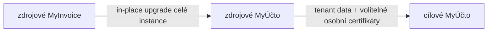

# FR: Přenos jedné firmy mezi instancemi MyÚčta

> Typ: Feature request
>
> Stav: návrh
>
> Dotčený projekt: MyÚčto (backend, webové UI a databázové migrace)
>
> MyInvoice se v rámci této funkce nemění. Nejdřív se podporovaným in-place postupem povýší celá zdrojová instalace na MyÚčto a teprve potom se z ní přenese vybraná firma.

## Shrnutí

Přidat bezpečný jednorázový přenos jedné firmy z jedné instance MyÚčta do jiné již používané instance MyÚčta. Přenos vždy založí nového dodavatele a nikdy neaktualizuje ani nepřepisuje existující firmu.

Celý postup se ovládá z webového rozhraní MyÚčta. Správce ve zdrojové instanci vytvoří krátkodobý jednorázový kód pro konkrétní firmu. Superadmin v cílovém MyÚčtu vloží adresu zdroje a tento kód do průvodce. Cílový server následně přes HTTPS nejprve ověří přesnou shodu verze aplikace, buildu, migrací, tenantového registru a registrovaného schématu, stáhne šifrovaný snapshot po blocích, zobrazí preflight, vyžádá nutná mapování a po potvrzení založí novou firmu. Pro běžný přenos není potřeba CLI, přístup k databázím ani ruční kopírování `storage/`.

Výchozí rozsah tvoří pouze tenantová data vybrané firmy. Uživatelské účty, hesla, MFA, session, API tokeny, role celé instance, licence, globální konfigurace a globální číselníky se nekopírují. Odkazy na uživatele a globální číselníky se mapují na již existující cílové záznamy. Jako výslovně volitelnou přílohu lze přenést jednotlivé osobní certifikáty skutečně navázané na převáděnou firmu, ale pouze po samostatném souhlasu jejich zdrojového i cílového vlastníka; celý osobní trezor ani vazby na jiné firmy se nikdy nekopírují.



Tím se oddělí dva různé problémy:

1. kompatibilita MyInvoice → MyÚčto se vyřeší jednou při upgradu zdroje,
2. transfer řeší už jen stejný produkt na obou stranách a může sdílet jediný registr tabulek, secrets, souborů a referencí.

## Motivace a současný stav

Projekt má tři příbuzné, ale odlišné mechanismy:

- upgrade celé instalace z MyInvoice do MyÚčta zachovává celou databázi, uživatele i instanční nastavení; není určen k vložení jedné firmy do již používaného cíle,
- [`ArchiveRestoreService`](api/src/Service/Accounting/Archive/ArchiveRestoreService.php) umí obnovit účetní archiv jako novou firmu a přemapovat ID, ale archiv pokrývá jen zvolenou část agend a záměrně nepřenáší většinu souborů a credentials,
- běžné REST API je kurátorovaný provozní pohled; neumí úplný historický snapshot ani atomickou obnovu a nesmí obcházet účetní a daňová workflow.

Chybí podporovaná cesta pro situaci, kdy správce:

- povýšil původní MyInvoice in-place na MyÚčto,
- provozuje jiné cílové MyÚčto, ve kterém už jsou další firmy,
- chce z první instance zkopírovat jednu vybranou firmu včetně její historie a souborů,
- ale nechce přenášet uživatelskou databázi ani jiná data celé instance.

Přímý MyInvoice → MyÚčto transfer by vyžadoval udržovat exportní implementaci, schématické adaptéry a bezpečnostní registr také v rychle se měnícím upstreamu. Po zavedení in-place upgradu tato složitost nepřináší uživatelskou hodnotu. Zdroj musí být před tenantovým přenosem MyÚčto.

## Cíle

- Přenést jednu vybranou firmu mezi dvěma instancemi přesně stejné verze a buildu MyÚčta se shodným migračním stavem a tenantovým schématem.
- Celý podporovaný postup zpřístupnit v UI bez samostatného transfer CLI.
- V cíli vždy vytvořit nového dodavatele; nikdy nenabízet merge do existujícího.
- Ve výchozím profilu přenést jen tenantová obchodní, účetní, daňová a konfigurační data firmy.
- Zachovat dostupné PDF, přílohy, XML, dodejky a další tenantové binární soubory.
- Přemapovat všechna interní ID bez kolizí s existujícími daty cíle.
- Globální reference mapovat podle stabilního klíče, nikdy globální tabulky nepřepisovat.
- Uživatelské účty nevytvářet ani nekopírovat; vazby mapovat pouze na existující cílové uživatele.
- Přešifrovat přenositelné tenantové secrets ze zdrojového na cílový aplikační klíč.
- Volitelně přenést jednotlivé osobní P12/PFX navázané na převáděnou firmu, s povinným mapováním identity a dvoustranným souhlasem vlastníka.
- Umožnit preflight bez zápisu do business tabulek, s úplným seznamem problémů a rozhodnutí.
- Nikdy během transferu nespouštět databázové ani datové migrace a ve v1 nepřevádět payload mezi různými verzemi.
- Přerušovaný přenos obnovit bez opakování již přijatých bloků.
- Při chybě nevytvořit částečnou firmu a nezměnit jiné firmy v cíli.
- Po importu ponechat všechny externí automatizace deaktivované.
- Fungovat na Windows, Linuxu a v Dockeru.

## Mimo rozsah

- Přímý export z MyInvoice. Zdrojové MyInvoice se nejprve povýší na MyÚčto.
- Upgrade celé instalace, kopie celé databáze nebo disaster-recovery backup.
- Průběžná synchronizace či replikace mezi instancemi.
- Aktualizace nebo sloučení s existujícím dodavatelem v cíli.
- Obousměrná synchronizace změn po dokončení transferu.
- Libovolný výběr SQL tabulek nebo expertní režim `--tables`.
- Přenos uživatelských účtů, globálních rolí, oprávnění, licence nebo instanční konfigurace.
- Hromadný přenos celého osobního certifikátového trezoru nebo certifikátů bez vazby na převáděnou firmu.
- Automatické smazání či deaktivace zdrojové firmy po úspěšném importu.
- Automatická aktivace IMAP skenerů, odesílání e-mailů, recurring úloh, externích importů, podání nebo podpisových profilů.
- Přehrání historie přes běžné CRUD endpointy.
- Implementace transformačních adaptérů mezi různými verzemi MyÚčta; protokol pro ně pouze připraví verzovaná metadata a explicitní kompatibilitní rozhraní.

## Pevná hranice tenant-only a volitelných osobních příloh

Transfer nesmí odvozovat rozsah jen z přítomnosti sloupce `supplier_id`. Některé tenantové řádky jsou vlastněné nepřímo přes rodiče, některé tabulky se sdílejí globálně a některé tenantové tabulky obsahují odkazy na instanční uživatele. Rozsah proto určuje explicitní, verzovaný a volatelný registr.

Každá tabulka, sloupec, reference a souborová oblast musí mít právě jednu politiku:

| Politika | Význam | Příklad |
|---|---|---|
| `tenant_root` | kořen přenášené firmy | vybraný řádek `supplier` |
| `tenant_owned` | přenést řádky a remapovat ID | faktury, klienti, deník |
| `tenant_owned_indirect` | vybrat přes vlastnický JOIN | položky a přílohy bez `supplier_id` |
| `tenant_relation` | nevkládat raw; vytvořit z rozhodnutí importu | `user_suppliers` |
| `global_reference` | pouze mapovat na existující cílový záznam | měna, země, systémová role |
| `instance_owned` | nikdy nepřenášet | `users`, licence, globální nastavení |
| `personal_secret_attachment` | jen jednotlivě, s mapováním vlastníka a oboustranným souhlasem | osobní P12/PFX navázaný na firmu |
| `runtime_derived` | vynechat a regenerovat nebo resetovat | cache, joby, poslední chyba |
| `unsupported` | preflight zastavit s jasným důvodem | dosud nezařazená agenda |

Registr musí popsat také:

- filtr vlastnictví a stabilní pořadí exportu,
- primární klíč a způsob remapu,
- skutečné FK i polymorfní a soft reference,
- globální přirozené klíče,
- generované a odvoditelné sloupce,
- secret politiku jednotlivých sloupců,
- selektor kandidátů a souhlasovou politiku každé osobní secret přílohy,
- tenantové cesty pod `RuntimePaths`, jejich vazbu na řádky a cílovou cestu,
- post-import invarianty konkrétní agendy.

Současné seznamy v `ArchiveService` a `ArchiveRestoreService` jsou užitečný základ, ale jsou privátní a pokrývají jen účetní archiv. Při implementaci se nesmějí zkopírovat do třetího seznamu. Má vzniknout veřejně volatelný `TenantDataRegistry` jako SSOT; účetní archiv z něj použije svůj bezpečně vymezený profil a transfer úplný tenantový profil.

Architekturní test porovná registr se skutečným schématem. Nová tabulka s tenantovou vazbou, nový neklasifikovaný secret sloupec nebo nový souborový typ musí test i runtime preflight zastavit, dokud nedostane explicitní politiku.

## Uživatelský tok v UI

### 1. Příprava zdroje

Pokud zdroj stále běží jako MyInvoice, správce nejprve provede podporovaný in-place upgrade celé instalace na MyÚčto. Tenantový průvodce se v MyInvoice nezobrazuje a protokol produkt `myinvoice` odmítne stabilní chybou `source_upgrade_required`.

Obě instance musí mít přesně shodnou aplikační verzi a immutable build revision, dokončené všechny migrace, shodnou sadu aplikovaných migrací, shodný hash `TenantDataRegistry` a shodný fingerprint registrovaného tenantového schématu. Jakýkoli rozdíl zastaví preflight ještě před vytvořením živého plánu nebo snapshotu. Nestačí porovnat jen nejvyšší číslo migrace: obě strany musí mít stejnou úplnou sadu a žádnou čekající migraci. Transfer sám migrace nikdy nespouští; správce nejprve aktualizuje a domigruje obě instance na tentýž release.

### 2. Jednorázové oprávnění ve zdroji

Správce otevře ve zdrojovém MyÚčtu **Nastavení → Firma → Přenos firmy**. Průvodce:

1. ukáže, že se vytváří kopie a zdroj se po dokončení nesmaže,
2. zkontroluje, že zdroj nemá čekající migrace, a ověří tenantový registr, dostupnost souborů a dešifrovatelnost secrets,
3. vyžádá step-up autentizaci a podle politiky instance MFA,
4. vytvoří oprávnění svázané s aktuálním `supplier_id`, jedním budoucím transferem a krátkou expirací,
5. jednou zobrazí zdrojovou HTTPS adresu a náhodný přenosový kód.

Kód nesmí být v URL. Uživatel jej zkopíruje do cílového průvodce. Ve zdroji lze oprávnění kdykoli odvolat a je vidět jeho stav, cílový fingerprint po spárování a průběh exportu.

### 3. Přenos v cíli

Superadmin otevře **Administrace → Firmy → Přenést z jiného MyÚčta**. Tato akce patří na stávající stránku správy dodavatelů a dodrží společný `ActionBar` a sémantické styly tlačítek.

Průvodce má tyto kroky:

1. **Připojení** — adresa zdrojového MyÚčta a jednorázový kód.
2. **Kompatibilita** — přesná shoda verze aplikace, buildu, aplikovaných migrací, registru a tenantového schématu; teprve potom velikost, moduly a dostupné diskové místo.
3. **Plán bez odstávky** — identita firmy, orientační počty, varování, chybějící soubory, globální reference a účetní kontroly nad živými daty.
4. **Mapování uživatelů** — pouze na již existující cílové účty; žádný účet se nevytváří.
5. **Osobní certifikáty** — volba jednotlivých kandidátů, stav souhlasu zdrojového vlastníka, mapování na cílového vlastníka a jeho přijetí; výchozí stav je nepřenášet.
6. **Potvrzení** — explicitní souhlas s deaktivovanými integracemi a případnými podporovanými vynecháními.
7. **Přenos a import** — krátký cutover lock jen při sestavení autoritativního snapshotu, resumable download, opakovaný preflight a atomické založení nové firmy.
8. **Dokončení** — výsledný report a checklist pro ruční test a aktivaci integrací.

Rozhodnutí se kryptograficky svážou s plánem. Finální preflight po stažení smí automaticky pokračovat jen tehdy, pokud nepřibyla nová chyba, vynechání ani rozhodnutí vyžadující souhlas. V opačném případě cíl import pozastaví nad již staženým neměnným snapshotem a vrátí průvodce k jeho aktualizovanému plánu; zdrojový lock je v té době už uvolněný.

Zúžení okna nebo mobilní zobrazení nesmí toolbar ani kroky průvodce nechat přetékat. Všechny nové texty se doplní do českého i anglického locale.

### 4. Pokračování po výpadku

Cílový backend ukládá stav jobu a hashe přijatých bloků. Po reloadu stránky, restartu webu nebo výpadku sítě UI naváže prvním chybějícím blokem. Opakovaný upload i commit jsou idempotentní. Pokud vyprší zdrojové oprávnění, UI vyžádá nový kód a bezpečně jej připojí ke stejnému nedokončenému transferu až po ověření stejného zdroje, firmy a manifestu.

### 5. Nedostupný zdroj

První verze počítá s tím, že cílový server dosáhne na zdrojový server přes HTTPS. Ruční databázová kopie ani CLI nejsou fallback.

Pozdější verze může nad stejným formátem přidat UI-only přenos přes šifrovaný soubor: cíl vytvoří importní kód s veřejným klíčem, zdroj pro něj nabídne stažení balíčku a uživatel balíček nahraje do cíle. Tento transport nesmí měnit tenantový registr ani importní logiku a není podmínkou první implementace.

## Navržená architektura

Řešení je celé v MyÚčtu a skládá se ze čtyř částí:

1. společný `TenantDataRegistry`, snapshot exporter a importér,
2. zdrojové exportní API chráněné jednorázovým transfer grantem,
3. cílový serverový koordinátor, který data přímo stahuje a importuje,
4. dvě UI části: vytvoření oprávnění ve zdroji a importní průvodce v cíli.

Externí import endpoint cíle není potřeba. Cílový koordinátor volá lokální aplikační služby přímo a navenek komunikuje pouze se zdrojovým exportním API. Browser řídí stav přes běžnou přihlášenou admin session, ale nestreamuje payload a nikdy nezpracovává PFX, hesla ani jiné secrets.

Tok je source grant → capability check → živý plán → mapování a případné souhlasy s osobními certifikáty → krátký source lock a neměnný snapshot → resumable download → autoritativní preflight → atomický import a report.

Doménová logika exportu a importu nesmí žít v controllerech ani ve frontendu. API action pouze autorizuje a volá sdílenou službu. Stejný importér musí obsloužit přímý serverový přenos i případný budoucí upload šifrovaného balíčku.

## Zásadní návrhová rozhodnutí

### Vždy nová firma

Importní služba nepřijímá `target_supplier_id`. Při commitu vždy vytvoří nový řádek `supplier`. Existující firmu nelze vybrat ani skrytým expertním parametrem. Obchodní čísla mohou zůstat stejná, protože jejich unikátnost je tenantová, ale všechna databázová ID se přidělí znovu.

### MyÚčto na obou stranách

Zdrojový handshake musí vrátit `product: myucto`. Přímá kompatibilita s MyInvoice, detekce jeho starých schémat ani transformační adaptéry nejsou součástí transferu. Uživatelská chyba musí vysvětlit, že zdroj je nejprve nutné povýšit in-place.

### Přesná kompatibilita v1 bez migrací

První verze podporuje pouze identický kompatibilitní profil: stejný `app_version`, stejný immutable `build_revision`, stejný transfer formát, stejný hash úplné sady aplikovaných migrací, žádné pending migrace, stejný `TenantDataRegistry` hash a stejný fingerprint registrovaného tenantového schématu. Kontrola je blokující a proběhne před plánem i exportem. Transfer nesmí automaticky spouštět `migrate.php`, upravovat schéma ani transformovat tenantová data mezi verzemi.

Infrastruktura přesto zůstane připravená na budoucí explicitní adaptéry: capabilities i manifest nesou samostatně verzi zdroje, buildu, formátu, migrační fingerprint, registr a schema fingerprint a kompatibilitu vyhodnocuje samostatná volatelná služba. Ve v1 její registr obsahuje pouze `identity` profil pro přesnou shodu. Budoucí adaptér musí být pojmenovaný, směrový, explicitně allowlistovaný pro konkrétní dvojici profilů a samostatně otestovaný; smí transformovat pouze verzovaný logický payload mezi dvěma již domigrovanými instancemi, nikdy spouštět jejich DB migrace. Obecný fallback ani automatický downgrade se nepřipravuje.

### Pevný úplný tenantový profil

Výchozí a podporovaný režim přenáší úplný registrovaný tenant. Uživatel nevybírá SQL tabulky. Může pouze potvrdit předem definovanou politiku pro volitelné či nepřenositelné objekty a jednotlivě připojit osobní certifikáty splňující souhlasovou politiku. Účetní a daňové jádro nelze částečně vypnout a osobní secret příloha je vždy defaultně vypnutá.

### Transfer snapshot místo CRUD

Běžné endpointy aplikují aktuální workflow: přidělují čísla, generují PDF, účtují, odesílají události nebo neumožňují vložit historický stav. Transfer proto používá verzovaný logický snapshot a cílový importér s remapem ID.

### Žádné implicitní kopírování instančních dat

`users`, role, oprávnění, globální číselníky ani konfigurace se nevkládají a neaktualizují. Import může mimo nový tenantový graf zapsat pouze:

- technický import job a audit transferu,
- explicitně potvrzené vazby nové firmy na existující cílové uživatele,
- jednotlivé osobní vault credentials a jejich vazbu na novou firmu, pouze pokud prošly oboustranným souhlasem vlastníka,
- mapy starých a nových ID držené po nezbytnou retenční dobu.

Jakákoli jiná změna instanční nebo cizí tenantové tabulky je chyba a test musí porovnat stav před a po importu.

### Secrets se přešifrují na serverech

Zdrojový `app.secret_encryption_key`, předchozí klíče ani `app.pepper` se nikdy nepřenášejí. Zdroj dešifruje konkrétní tenantový secret pouze při stavbě šifrovaného streamu. Cíl jej bezprostředně zašifruje svým klíčem a správným kontextem. Browser ani karanténa nesmějí obsahovat plaintextovou kopii.

### Bezpečný výchozí stav

Importované integrace a profily se deaktivují bez ohledu na stav ve zdroji. Původní aktivní stav se uloží jen do výsledného reportu jako informace pro správce. Nic se po importu samo neodešle, nenačte ani nepodepíše.

## API a stavové endpointy

Přesné cesty lze před implementací upravit. Protokol je verzovaný a všechny veřejně dosažitelné endpointy a schémata musí být synchronní s `api/openapi.yaml`.

### Lokální admin API

Lokální endpointy používají browser session, CSRF, RBAC a u citlivých operací step-up; veřejný API token se odmítá.

- Zdroj: `POST/GET/DELETE /api/admin/tenant-transfer-grants[/{id}]` vytvoří, zobrazí nebo odvolá grant aktuální firmy.
- Cíl: `POST/GET/DELETE /api/admin/tenant-transfers[/{id}]`, `PUT .../{id}/decisions` a `POST .../{id}/commit` řídí job, mapování, commit a úklid.
- Vlastníci: `POST/DELETE .../personal-credentials/{credentialRef}/consent|accept` dovolí pouze vlastní step-up souhlas či jeho odvolání.

### Inter-instance exportní API

Každé MyÚčto může vystavit zdrojové `GET capabilities`, `POST plans`, `POST/GET/DELETE exports`, `GET exports/{id}/chunks/{index}` a `POST exports/{id}/release` pod `/api/tenant-transfer/v1`. Přijímají jen speciální transfer grant, nikdy běžný `read` či `read_write` token. Cíl nemá veřejný chunk-upload ani import-token endpoint; koordinátor stahuje data a lokální importér volá přímo.

### Kompatibilita a fingerprinty

Capabilities vrátí produkt, přesný `app_version`, immutable `build_revision`, verzi formátu, `pending_migrations`, `migration_set_hash`, verzi a hash `TenantDataRegistry`, `tenant_schema_hash`, feature a secret registry, kryptografické sady, limity, resume/lock podporu, bezpečný instance fingerprint a kompatibilitní profily. Neobsahují hostname, DB název ani secrets.

`migration_set_hash` je hash kanonicky seřazené úplné sady aplikovaných migračních identifikátorů a checksumů jejich souborů; na obou stranách musí být `pending_migrations=false`. Kontrola nejvyššího čísla migrace nestačí.

`tenant_schema_hash` kanonizuje registrované tabulky, sloupce, generované výrazy, klíče, indexy a FK bez AUTO_INCREMENT counterů a statistik. Zahrne i instanční objekty používané `personal_secret_attachment`; legacy objekt musí být explicitně klasifikovaný.

Jedna volatelná backendová služba používá fingerprinty v capabilities, plánu, exportu i testech. V1 vybírá pouze `identity` a každý rozdíl blokuje před plánem; metadata a registr služby jsou extension point pro budoucí explicitní směrové adaptéry, z nichž nyní není implementován žádný.

### Stavový model

```text
created → checking → planning → preflight_required
preflight_required → ready_to_transfer
preflight_required → personal_consent_required → ready_to_transfer
ready_to_transfer → preparing_source → transferring → validating
validating → importing → succeeded
validating → final_confirmation_required → importing
každý nedokončený stav → failed/cancelled/expired
```

`personal_consent_required` vznikne jen pro vybranou osobní přílohu; její odškrtnutí nebo potvrzené bezpečné vynechání dovolí čistě tenantový transfer. Zdrojový export používá `created`, `preparing`, `ready`, `transferring`, `released`, `cancelled`, `expired` a `failed`. Chyby mají stabilní kód a bezpečné detaily bez secrets.

## Přenosový formát

### Veřejná hlavička

Nešifrovaná hlavička bloku smí obsahovat pouze technická data:

```json
{
  "format": "myucto-tenant-transfer",
  "version": 1,
  "transfer_id": "019…",
  "cipher_suite": "x25519-xchacha20poly1305",
  "target_key_id": "sha256:…",
  "target_attestation_key_id": "sha256:…",
  "chunk_index": 0
}
```

Název firmy, IČO, e-maily, názvy souborů, tabulky, počty záznamů ani jiné tenantové údaje do veřejné hlavičky nepatří.

### Šifrovaný manifest

Vnitřní manifest obsahuje například:

```json
{
  "format": "myucto-tenant-transfer",
  "version": 1,
  "transfer_id": "019…",
  "source": {
    "product": "myucto",
    "app_version": "…",
    "build_revision": "…",
    "compatibility_profile": "identity",
    "pending_migrations": false,
    "migration_set_hash": "sha256:…",
    "tenant_schema_hash": "sha256:…",
    "tenant_registry_version": 1,
    "tenant_registry_hash": "sha256:…",
    "instance_fingerprint": "sha256:…"
  },
  "supplier": {
    "source_ref": "supplier:3",
    "company_name": "…",
    "ic": "…"
  },
  "consistent_at": "2026-08-20T12:00:00Z",
  "features": ["core", "documents", "accounting", "mail", "signing"],
  "personal_secret_attachments": [
    {
      "kind": "certificate_vault",
      "source_ref": "vault:42",
      "owner_ref": "actor:7",
      "fingerprint_sha256": "…",
      "source_consent_binding_sha256": "…",
      "target_acceptance_binding_sha256": "…"
    }
  ],
  "tables": {
    "clients": {"rows": 120, "sha256": "…"},
    "invoices": {"rows": 1840, "sha256": "…"}
  },
  "files": {
    "sha256:…": {"size": 42112, "kind": "invoice_pdf"}
  },
  "secret_registry_version": 1
}
```

Tabulky se ukládají jako streamovatelné JSONL nebo rovnocenný verzovaný formát. Binární soubory jsou content-addressed podle SHA-256 a manifest na ně odkazuje logickým typem a vlastníkem, nikdy absolutní cestou zdroje.

Manifest opakuje kompatibilitní fingerprinty z handshake, aby je cíl ověřil také nad konkrétním snapshotem. Hodnoty se zahrnou do autentizovaných metadat. Změna buildu, migrací, registru nebo registrovaného schématu mezi plánem a finálním exportem transfer zastaví; snapshot z jiného kompatibilitního profilu nelze podstrčit do již schválené relace.

Osobní secret přílohy jsou vždy uvnitř šifrovaného manifestu a každá nese vlastní zdrojovou referenci, vlastníka, fingerprint a hashe obou souhlasů svázaných s transferem, firmou a cílovou instancí. Cíl před žádostí o snapshot vytvoří z lokálního přijetí krátkodobý doklad podepsaný jednorázovým Ed25519 atestačním klíčem spárovaným s transferem. Zdroj ověří podpis tohoto dokladu i vlastní souhlas a teprve potom secret vloží do snapshotu; absence nebo změna kteréhokoli souhlasu přílohu vyřadí ještě před jeho sestavením.

### Šifrování

Doporučená sada pro první verzi:

- cílová instance vytvoří jednorázový pár X25519 pro obal payloadu a oddělený pár Ed25519 pro atestace cílových souhlasů,
- soukromé části drží pouze cíl; pro restart je uloží zašifrované cílovým aplikačním klíčem a oddělenými kontexty transferu,
- zdroj vygeneruje náhodný 256bitový content key,
- content key zabalí pro veřejný klíč cíle,
- obsah před šifrováním komprimuje,
- stream šifruje autentizovaně pomocí XChaCha20-Poly1305 secretstream,
- `transfer_id`, verze, zdrojový a cílový fingerprint a index bloku vstupují do autentizovaných metadat,
- oba soukromé klíče relace cíl po dokončení nebo expiraci zničí.

Přímé server-to-server spojení neodstraňuje potřebu obalu. Chrání karanténu, proxy a dočasné soubory a zajišťuje, že payload lze otevřít jen konkrétní cílovou relací. HTTPS je navíc povinné kvůli autentizačnímu kódu a HTTP metadatům. Neúspěšná kryptografická validace nikdy nesmí přejít na plaintext.

## Rozsah přenášených dat

Přesný registr vznikne při implementaci. Minimální úplný profil zahrnuje:

| Skupina | Příklady | Politika |
|---|---|---|
| Firma | bezpečné sloupce `supplier`, bankovní účty, šablony a nastavení | nový supplier, lokální ID |
| Přístupy | členství a historické actor reference | mapovat na existující cílové uživatele |
| Obchod | klienti, projekty, výkazy práce, ceník | nová ID a FK remap |
| Vydané doklady | faktury, položky, platby, PDF, přílohy, recurring | zachovat čísla a historii, recurring vypnout |
| Přijaté doklady | doklady, položky, platby, PDF, ISDOC a vazby | zachovat historii a originály |
| Banka a pokladna | výpisy, transakce, párování, pravidla | remap, zachovat tenantovou deduplikaci |
| Dokumenty | složky, dokumenty, vazby a fyzické soubory | content-addressed soubory a remap |
| Účetnictví | období, osnova, deník, kontace, majetek a uzávěrky | remap a bilanční kontroly |
| Daně a podání | evidence, snapshoty, XML, dodejky a artefakty | zachovat historii, nic znovu neodesílat |
| Sklad a e-shop | karty, číselníky firmy, pohyby a média | jen aktivní tenantové moduly |
| Mzdy a další moduly | zaměstnanci, běhy, podklady a exporty | úplný modul nebo blokující chyba |
| E-mail | profily, parsery, mapování a dedup historie | přešifrovat secrets, deaktivovat |
| Podpisy firmy | profily a tenantové souborové credentials | přenést, ověřit, deaktivovat |
| Osobní certifikáty | jednotlivé vault P12/PFX aktivně navázané na firmu | defaultně vynechat; přenést jen s mapováním a dvojím souhlasem |

Přenos je úplný podle registrovaných feature skupin. Pokud zdroj používá tenantový modul, který cíl nebo formát nepodporuje, nejde o běžný warning: preflight import zastaví. Ztrátové pokračování lze nabídnout jen pro předem určenou nesamostatnou skupinu a s konkrétním potvrzením, nikdy globálním `allow_missing`.

### Záměrně nepřenášená instanční data

- řádky `users` a jejich `password_hash`, profil a globální role,
- TOTP secrets, recovery kódy a WebAuthn/passkey credentials,
- session, remember-me, resetovací a ověřovací tokeny,
- veřejné API tokeny, jejich scopes a IP pravidla,
- `roles` a `role_permissions`; systémové role se mapují podle `system_key`,
- licence, platební stav licence a aktivační identita instance,
- globální konfigurace, aplikační klíče, pepper a předchozí keyring,
- tabulka migrací, globální audit, serverové logy a metriky,
- běžící či čekající background joby a jejich procesní stav,
- cache, materializované/odvoditelné read modely a dočasné soubory,
- globální číselníky; pouze se mapují podle stabilního kódu,
- osobní vault credentials bez aktivní vazby na převáděnou firmu nebo bez úplného souhlasu obou vlastníků,
- absolutní cesty, hostnames, interní adresy a runtime konfigurace zdroje.

V preflight reportu se zobrazí souhrn záměrně vynechaných kategorií, ne každý řádek instanční tabulky. Neznámé vynechání však zůstává blokující chybou.

## Mapování ID a referencí

- `supplier.id` se vždy změní na nově přidělené ID.
- Každá tenantová tabulka s vlastním ID dostane mapu `old_id → new_id`.
- Skutečné FK se ověří proti `information_schema`, ale importní význam určuje registr; samotná introspekce nepokryje soft reference.
- Polymorfní, JSON a jiné soft reference musí být v registru explicitně.
- Složené klíče se přepíší novým `supplier_id` a mapovanými ID.
- Generované sloupce se nevkládají a cílová databáze je dopočítá.
- Globální číselníky se mapují podle stabilního přirozeného klíče, například kódu měny, země, sazby či systémové role, nikdy podle zdrojového ID.
- Chybějící globální klíč import nevytvoří; vyžádá upgrade cíle nebo explicitní ruční nápravu před commitem.
- Obchodní identifikátory, například číslo faktury a variabilní symbol, se v rámci nové firmy zachovají.
- Každá nevyřešená reference je blokující chyba, ne tiché `NULL`.

Importér může rozšířit ověřené principy `ArchiveRestoreService`, ale remap, soft-reference registr a tenantová izolace musí být sdílené SSOT, ne dvě postupně driftující implementace.

## Mapování uživatelů bez přenosu účtů

Zdrojové účty se nekopírují a cíl neposílá pozvánky jako vedlejší efekt transferu. Importující superadmin se vždy stane administrátorem nové firmy, aby po commitu existoval bezpečný vlastník.

Pro další odkazy preflight sestaví seznam zdrojových actor referencí:

- zdroj přenese neprůhledné `source_actor_ref` a jen minimální zobrazovací metadata nutná pro rozhodnutí,
- automatický návrh shody může použít per-transfer HMAC normalizovaného e-mailu; raw zdrojový e-mail kvůli automatickému porovnání nemusí být uložen v cíli,
- správce může actor reference namapovat pouze na existujícího cílového uživatele,
- systémová membership role se mapuje podle `system_key`; custom role vyžaduje ruční výběr existující cílové role,
- nové `user_suppliers` vzniknou jen pro výslovně potvrzená mapování,
- nullable historický actor může být podle politiky agendy odpojen a uveden v reportu; povinný nebo bezpečnostně citlivý actor mapování vyžaduje,
- mapovací metadata se po retenční době karantény odstraní a nestanou se novou uživatelskou databází.

Vlastnictví osobního certifikátu, schválení, podpis nebo jiná operace vázaná na konkrétní fyzickou osobu nesmí být automaticky připsána importujícímu superadminovi.

U osobního vault credential je mapování vlastníka povinné a shoda e-mailu je pouze návrh. Zdrojový vlastník musí schválit export konkrétního fingerprintu pro konkrétní cílovou instanci a namapovaný cílový uživatel musí pod svým účtem schválit přijetí privátního klíče. Superadmin nesmí udělit žádný z těchto souhlasů za jinou osobu.

## Přenos a přešifrování secrets

Registr citlivých sloupců určí pro každý údaj jednu z politik:

- `reencrypt_v1`,
- `reencrypt_v2` s přesným kryptografickým kontextem,
- `reencrypt_personal_with_dual_consent` pro jednotlivý osobní secret svázaný s oběma souhlasy,
- `omit_and_reconfigure`,
- `external_reference`,
- nebo `not_secret` s explicitním zdůvodněním.

Automatická kontrola zastaví export při nalezení nezaregistrovaného sloupce odpovídajícího alespoň vzorům `_enc`, `_ciphertext`, `password`, `secret`, `token`, `private_key` nebo `credential`. Výjimka se uděluje konkrétnímu symbolu/sloupci, nikdy celé tabulce nebo souboru.

Zdrojová instance:

1. ověří, že umí všechny tenantové a výslovně schválené osobní secrets dešifrovat aktuálním nebo předchozím klíčem a správným kontextem,
2. dešifruje jednu hodnotu jen při stavbě zašifrovaného streamu,
3. nezapisuje plaintext do dočasného souboru, job tabulky ani logu,
4. po použití citlivé buffery podle možností runtime vynuluje.

Cílová instance:

1. otevře transportní obal jen uvnitř karanténního import jobu,
2. secret okamžitě zašifruje aktuálním cílovým klíčem a stejným doménovým kontextem,
3. původní ciphertext ani zdrojový key ID neukládá do business tabulek,
4. před commitem ověří opětovnou dešifrovatelnost každé hodnoty,
5. uloží profil jako neaktivní, případný OAuth vztah označí k nové autorizaci a osobní credential zpřístupní pouze schválenému cílovému vlastníkovi.

Stejný produkt na obou stranách umožní sdílet registry kryptografických kontextů. Ani tak se nesmí předpokládat, že ciphertext lze jen zkopírovat.

## E-mailové profily a bankovní parsery

Přenést alespoň tenantové:

- `email_profiles`, včetně SMTP a IMAP konfigurace,
- `bank_email_imap_settings`,
- mapování bankovních e-mailů na účty firmy,
- deduplikační historii zpracovaných zpráv, pokud je tenantově vlastněná,
- vazby na importované bankovní výpisy, transakce a doklady.

Globální seznam podporovaných providerů se nekopíruje; mapuje se podle stabilního kódu. SMTP/IMAP hesla se přešifrují. Poslední chyba, běžící scan a jiné diagnostické hodnoty se resetují.

Všechny profily a skenery zůstanou vypnuté. Výsledný report doporučí:

1. ponechat zdrojový skener vypnutý nebo určit jednoznačný cutover okamžik,
2. otestovat spojení v cíli,
3. ověřit složku a mapování bankovních účtů,
4. zkontrolovat dedup watermark,
5. teprve potom skener ručně aktivovat.

## Podpisové certifikáty

### Tenantový souborový P12/PFX

Zdroj vyřeší cestu přes `RuntimePaths`, case-insensitive ověří containment v tenantovém adresáři, načte původní P12/PFX, dešifruje passphrase a přes OpenSSL ověří certifikát, privátní klíč, jejich shodu a fingerprint. Chybějící, absolutní nebo legacy cesta mimo storage je blokující problém. PFX a passphrase vstoupí jen do end-to-end šifrovaného payloadu.

Cíl uloží stejné bajty přes `RuntimePaths` s omezenými POSIX oprávněními nebo Windows ACL, passphrase zašifruje svým `SecretEncryption` a znovu ověří SHA-256, fingerprint i klíč. Profil zůstane neaktivní. PFX se nepřebaluje, interní heslo se nemění a historické podpisy či podací artefakty se kopírují bez nového podpisu.

### Osobní certifikátový trezor

Osobní credential je instanční uživatelský secret, nikoli tenantové vlastnictví. Nikdy se nepřenáší automaticky ani jako celý trezor; lze jej připojit jen jednotlivě jako `personal_secret_attachment` aktivně navázaný na firmu.

`epo_signing_credentials` obsahuje:

| Oblast | Obsah | Politika |
|---|---|---|
| Vlastník | `owner_user_id` | mapovat na existujícího cílového uživatele |
| PFX a heslo | aplikačně šifrovaný původní P12/PFX s privátním klíčem a chainem; samostatně šifrovaná passphrase | dešifrovat jen v paměti a přešifrovat cílem |
| Veřejná metadata | label, SHA-256 fingerprint, subject, issuer, serial, platnost a `ik_mpsv_present` | plán, kontrola a deduplikace |
| Lifecycle | created/updated/deleted timestamps | přenést význam, cílové časy vytvořit lokálně |
| Povolené firmy | `epo_signing_credential_suppliers`, `enabled_by`, `enabled_at` | vytvořit jen vazbu nové firmy |

Trezor neobsahuje přihlašovací heslo, MFA, session ani API tokeny. Jeden credential však může sloužit EPO, PDF, S/MIME i mzdovým podáním a být povolen více firmám.

#### Výběr a souhlasy

Preflight nabídne jen credential povolený firmě přes `epo_signing_credential_suppliers`, použitý jejím neodstraněným profilem přes `signing_credentials.vault_credential_id` nebo zvolený v `payroll_submission_signing_profiles`. Historická reference z `tax_submission_attempts` sama privátní klíč neexportuje; zachová se fingerprint, podpis a artefakty.

UI zobrazí pouze vlastníka, label, fingerprint, subject, issuer, platnost, použití a varování o sdílení s jinými firmami. Kandidáti jsou defaultně nezaškrtnutí a zbytek trezoru nevstoupí do manifestu.

Vybraný credential vyžaduje mapování vlastníka, vlastní step-up/MFA souhlas zdrojového vlastníka a vlastní step-up/MFA přijetí namapovaného cílového vlastníka. Oba souhlasy jsou jednorázově svázané s fingerprintem, firmou, transferem, vlastníky, oběma instancemi a expirací; superadmin je nesmí udělit za jinou osobu. Změna vazby nebo expirace vyžádá nové souhlasy.

#### Přenos, deduplikace a fallback

Zdroj ověří souhlas, Ed25519 doklad cílového přijetí a aktuální vazbu na firmu, dešifruje PFX v kontextu `epo:credential-pfx` a heslo v `epo:credential-passphrase`, ověří PFX, privátní klíč, fingerprint a hash a vloží je jen do šifrované secret části snapshotu. Cíl kontroly zopakuje a secrets okamžitě zašifruje vlastními kontexty.

Cíl deduplikuje podle cílového vlastníka a fingerprintu. Aktivní shodu reuse bez přepsání PFX, hesla, labelu či jiných vazeb; vlastnictví privátního klíče prokáže podpisem čerstvé nereplayovatelné source challenge, takže zdrojové PFX nemusí cestovat. Soft-deleted kolize vyžaduje výslovné rozhodnutí cílového vlastníka. Jinak vznikne nový credential a pouze vazba na nového dodavatele; vazby jiných zdrojových firem se nekopírují.

Bez souhlasu, mapování nebo vyřešené kolize se klíč nepřenese. `signing_credentials.vault_credential_id` se odpojí a credential i profil se deaktivují. `payroll_submission_signing_profiles` se kvůli povinným FK nevloží a report vyžádá nové nastavení. `tax_submission_attempts` zachová fingerprint a artefakty s nulovou credential referencí.

Přijetí credentialu ani supplier vazba nic neaktivují. Oprávněný uživatel aktivuje podpisový profil, EPO nebo mzdový kanál až v cílovém UI po step-up, kontrole vlastníka a syntetickém podpisovém testu.

## Konzistence zdrojového snapshotu

První plán a interaktivní mapování vzniknou nad živou firmou bez locku. Finální export po potvrzení však musí mít jednoznačný konzistentní okamžik:

- zdroj získá tenantový cutover lock s omezenou lease,
- lock blokuje mutace z webu, API a cronů pouze pro vybranou firmu, včetně recurring úloh a e-mailových parserů,
- ostatní firmy zůstávají plně dostupné,
- export používá konzistentní DB snapshot a zároveň kontroluje hashe souborů,
- zdroj během locku sestaví úplné neměnné a pro cíl zašifrované bloky,
- po uzavření manifestu a hashů zdroj lock uvolní; následný download, validace a import už zdrojovou firmu neomezují,
- cílový koordinátor lease obnovuje jen během přípravy snapshotu,
- při jeho pádu lock automaticky expiruje a zdrojový správce jej může uvolnit,
- úspěch zdrojovou firmu nesmaže ani automaticky znovu neaktivuje.

Po stažení cíl zopakuje celý preflight nad finálním snapshotem. Pokud se proti potvrzenému plánu objeví nové vynechání, mapování nebo blokující problém, nic neimportuje a vyžádá nové potvrzení. Lock už je v té době uvolněný a nikdy se nedrží během downloadu ani čekání na člověka.

UI před získáním locku ukáže odhad velikosti a očekávané doby omezení. Pokud implementace tenantový lock neumí, smí nabídnout nekonzistentní preview, ale ne ostrý commit úplného přenosu.

## Importní karanténa, transakčnost a rollback

Šifrované bloky se ukládají do karantény pod `RuntimePaths`, nikdy do webového rootu. Karanténa má limity na:

- celkovou velikost,
- počet souborů, tabulek a bloků,
- velikost jednoho souboru a JSONL řádku,
- kompresní poměr a hloubku archivů,
- dobu uložení,
- počet paralelních importů na instanci i uživatele.

Preflight dešifruje a validuje obsah, ale nezapisuje do business tabulek. Commit:

1. získá aplikační/advisory lock pro konkrétní transfer,
2. znovu ověří manifest, rozhodnutí a neměnnost zdrojového snapshotu,
3. připraví soubory ve staging adresáři na stejném filesystemu jako cílové storage,
4. zahájí DB transakci se zapnutými FK checks,
5. vloží nového dodavatele a data v topologickém pořadí,
6. přemapuje FK, soft reference, actor reference a globální klíče,
7. přešifruje secrets, vytvoří nebo bezpečně reuse schválené osobní credentials a uloží externí profily jako neaktivní,
8. provede databázové, účetní, daňové a souborové kontroly,
9. přesune staging soubory do finálních cest a commitne DB,
10. při chybě provede DB rollback a kompenzačně odstraní pouze soubory a nové vault řádky tohoto transferu; existující reuse credential nikdy nemění ani nemaže.

Úspěšný transfer se eviduje podle `transfer_id`, zdrojového fingerprintu a otisku manifestu. Opakovaný commit vrátí původní výsledek nebo `transfer_already_imported`; nikdy nevytvoří druhou firmu.

## Kontroly po importu

Před potvrzením commitu musí proběhnout alespoň:

- počty řádků a SHA-256 všech streamů proti manifestu,
- SHA-256 všech binárních souborů,
- kontrola všech FK a registrovaných soft referencí,
- kontrola, že žádné mapované ID neukazuje do jiné firmy,
- kontrola, že se nezměnil řádek jiné cílové firmy ani instanční data mimo explicitně schválené create/reuse operace osobních credentials,
- kontrola součtů položek a hlaviček dokladů,
- kontrola `prices_include_vat` na všech cestách tvořících doklady,
- kontrola účetní rovnosti MD = D po obdobích,
- kontrola vazeb DPH evidence na doklady a správná období,
- symetrie typů vydaných a přijatých dokladů,
- kontrola nezdvojených záloh a jejich finálních dokladů,
- kontrola decryptability přešifrovaných secrets,
- kontrola tenantových P12/PFX a jejich fingerprintů,
- kontrola PFX, passphrase, fingerprintu, privátního klíče a cílové decryptability každého schváleného osobního credential,
- kontrola obou souhlasů, cílového vlastníka a toho, že nevznikla vazba osobního credential na jinou firmu,
- kontrola, že nevybraný nebo neschválený osobní credential nevytvořil v cíli žádný vault řádek ani supplier vazbu,
- kontrola dostupnosti povinných příloh, PDF a podacích artefaktů,
- kontrola, že žádná externí automatizace není aktivní.

Výsledek obsahuje strojově čitelný i lidský report s počty, mapováními, varováními a novým `supplier_id`. Report nesmí obsahovat plaintext secrets, PFX, autentizační kód ani úplná data importovaných dokladů.

## Autentizace, oprávnění a síťová bezpečnost

### Zdrojový transfer grant

Transfer grant:

- vytvoří pouze admin dané firmy s oprávněním `tenant.transfer.export`,
- je pevně svázán s jedním `supplier_id` a jedním exportem,
- vyžaduje čerstvou session, step-up a dle politiky MFA,
- má náhodný secret zobrazený jen jednou; v DB je pouze hash,
- doporučeně expiruje za 30 minut, aktivní job může lease řízeně prodloužit,
- po prvním handshake se sváže s cílovým public-key a instance fingerprintem,
- po úspěchu, odvolání nebo expiraci se automaticky zneplatní,
- lze ručně odvolat a každý pokus se rate-limitovaně audituje.

Kód se posílá v samostatné autorizační hlavičce, nikdy v URL, query stringu ani refereru. Oddělený middleware jej nepřijme na žádném jiném endpointu. Cíl jej po dobu aktivního jobu uloží pouze zašifrovaný svým aplikačním klíčem a kontextem transferu, nikdy jej nevrací v progress API a po dokončení či zrušení jej odstraní.

### Cílové oprávnění

Založení nové firmy a commit transferu smí v první verzi pouze superadmin cíle. Použije běžnou admin session, CSRF ochranu a nový step-up těsně před commitem. Žádný cílový transfer token se neposílá zdroji ani nevystavuje externě.

### Souhlasy vlastníků osobních certifikátů

Souhlas není obecné oprávnění k trezoru. Zdrojová i cílová instance uloží samostatný jednorázový záznam svázaný s `transfer_id`, credential fingerprintem, zdrojovým supplierem, zdrojovým a cílovým instance fingerprintem, konkrétním owner user ID, akcí `export` nebo `accept`, časem step-up a expirací. Záznam neobsahuje PFX, passphrase ani jejich ciphertext.

Souhlas smí vytvořit nebo odvolat pouze jeho vlastník v přihlášené webové session; bearer token, superadmin impersonace ani obecný transfer grant nestačí. Cíl z přijetí vydá pouze pro tento export krátkodobý strukturovaný doklad s opaque cílovou owner referencí a detached Ed25519 podpisem; neobsahuje lokální profil ani jiné údaje cílového účtu. Veřejný atestační klíč se ve handshake sváže s cílovou instancí, transferem a X25519 klíčem payloadu. Před finálním snapshotem zdroj ověří podpis, vlastníka, nezměněný fingerprint, vazbu na firmu, cílové mapování, oba instance fingerprinty a nevypršené souhlasy.

Zdrojový souhlas se spotřebuje při uzavření neměnného snapshotu a dovoluje jen jeho resumable download v rámci stejného transferu; pozdější odvolání už nemůže vzít zpět vydané šifrované bajty. Cílové přijetí musí zůstat platné až do commitu. Jeho odvolání nebo expirace po stažení zabrání importu osobního credential, odstraní příslušnou karanténu a pro pokračování vyžádá nový snapshot a nové souhlasy. Po úspěchu se cílové přijetí spotřebuje a žádný doklad nelze replaynout pro jinou firmu, snapshot nebo transfer.

### SSRF ochrana

Protože cílový server přijímá z UI zdrojovou adresu a sám ji volá, jde o bezpečnostní hranici SSRF. Implementace musí:

- povolit pouze HTTPS a explicitně povolený port,
- normalizovat origin a po spárování jej už neměnit,
- zakázat URL credentials, fragmenty a automatické redirecty,
- ověřit DNS před každým novým spojením a chránit se proti DNS rebindingu,
- ve výchozím stavu blokovat loopback, link-local, multicast a cloud metadata adresy,
- privátní RFC1918 sítě povolit jen konfigurací a host allowlistem, protože je legitimně používají Docker a interní self-hosted instalace,
- omezit dobu spojení, velikost odpovědi, počet souběhů a rychlost retry,
- validovat TLS certifikát bez volby „pokračovat bez ověření“.

Browser nevolá zdroj přímo, takže není potřeba otevírat CORS a transfer kód se nedostane do zdrojových access logů jako URL parametr.

## Audit a provozní viditelnost

Zdroj eviduje:

- kdo a kdy vytvořil a odvolal exportní oprávnění,
- kterou firmu exportoval,
- cílový instance a public-key fingerprint,
- který vlastník udělil či odvolal souhlas s kterým credential fingerprintem a pro jaký cílový instance fingerprint,
- kdy získal a uvolnil cutover lock,
- objem, stav a výsledek exportu.

Cíl eviduje:

- kdo a kdy zahájil a potvrdil import,
- zdrojový instance fingerprint, transfer ID a manifest hash,
- potvrzená mapování uživatelů a globálních referencí,
- přijetí osobních credentials cílovými vlastníky, rozhodnutí reuse/create/skip a vzniklé supplier vazby,
- explicitně povolená vynechání,
- počty a hashe importovaných skupin,
- nové `supplier_id`, výsledek kontrol a případný rollback.

Audit neobsahuje payload, klíče, kód, hesla, tokeny ani celé PII z importovaných záznamů. UI ukáže bezpečný progress a poslední strojový stav i po restartu workeru.

## Chybové stavy

API a UI musí rozlišovat alespoň:

- `source_upgrade_required`,
- `source_unreachable`,
- `source_url_not_allowed`,
- `source_tls_invalid`,
- `capability_mismatch`,
- `application_version_mismatch`,
- `build_revision_mismatch`,
- `pending_migrations`,
- `migration_set_mismatch`,
- `unsupported_format_version`,
- `tenant_registry_mismatch`,
- `tenant_schema_mismatch`,
- `compatibility_adapter_unavailable`,
- `source_supplier_not_found`,
- `source_lock_unavailable`,
- `source_changed_during_export`,
- `unclassified_table`,
- `unclassified_reference`,
- `unclassified_secret`,
- `secret_decryption_failed`,
- `user_mapping_required`,
- `global_reference_missing`,
- `certificate_file_missing`,
- `certificate_invalid`,
- `personal_vault_credential_unmapped`,
- `personal_vault_source_consent_required`,
- `personal_vault_target_acceptance_required`,
- `personal_vault_consent_expired`,
- `personal_vault_consent_binding_changed`,
- `personal_vault_target_attestation_invalid`,
- `personal_vault_reuse_proof_invalid`,
- `personal_vault_credential_conflict`,
- `personal_vault_reencryption_failed`,
- `chunk_hash_mismatch`,
- `transfer_decryption_failed`,
- `manifest_validation_failed`,
- `reference_unmapped`,
- `target_unique_conflict`,
- `post_import_validation_failed`,
- `transfer_already_imported`,
- `transfer_expired`.

Chyba při preflightu ponechá šifrovanou karanténu do expirace, aby šlo opravit mapování. Chyba při commitu vrátí business DB a soubory do původního stavu. Zdrojový lock se uvolní i při chybě nebo řízeně expiruje.

## Bezpečnostní požadavky

- Zdrojový ani cílový aplikační klíč a pepper neopustí příslušnou instalaci.
- Browser, progress endpoint ani serverové logy neuvidí plaintext secrets nebo privátní klíč.
- Payload je šifrovaný pro konkrétní import session cíle.
- Všechny bloky mají autentizovanou integritu a ochranu proti změně pořadí, záměně cíle a replayi.
- Import odmítá path traversal, rozdílný casing mimo storage, absolutní cesty, symlinky mimo karanténu, kompresní bomby a překročení kvót.
- Importovaný obsah nesmí ovlivnit jinou firmu ani při škodlivě sestavených ID.
- Import nesmí vložit ani aktualizovat instanční tabulky mimo výslovně povolený technický audit, mapované membership vazby a schválené create/reuse operace jednotlivých osobních credentials.
- Osobní privátní klíč se nesmí dostat do snapshotu bez platného zdrojového souhlasu a cílového přijetí svázaného s konkrétním transferem, fingerprintem, vlastníky a oběma instancemi.
- Selektor osobních credentials nesmí následovat vazby na jinou firmu ani exportovat celý trezor vlastníka.
- Reuse existujícího cílového credential je append-only vůči nové supplier vazbě; nesmí přepsat jeho PFX, passphrase, label ani ostatní vazby.
- Transfer endpointy nepřijímají běžné API tokeny.
- Citlivé operace mají step-up, jednotný audit a rate limiting.
- Dočasná data a klíče se po úspěchu nebo expiraci odstraní.
- Neúspěšná kryptografická validace nemá plaintext fallback.

## Kompatibilita se stávajícími mechanismy

- In-place upgrade MyInvoice → MyÚčto zůstává povinným samostatným prvním krokem; transfer jej neduplikuje.
- Celoinstanční migrátor, účetní archiv `myucto-archive` i běžné API tokeny a scopes se nemění.
- V1 přijme pouze přesný profil `identity`; rozdíl verze, buildu, migrací, registru nebo schématu skončí před plánem a nelze jej obejít.
- Formát, capabilities a kompatibilitní služba jsou verzované pro budoucí pojmenované směrové adaptéry, ale v1 žádný adaptér neimplementuje ani nepoužívá.

## Dokumentace po implementaci

Aktualizovat `manual/06_Prevod_z_MyInvoice.md`, `manual/69_Ucetni_nastroje.md`, `manual/72_Multi_supplier.md`, `manual/73_Nastaveni.md`, `manual/74_Elektronicke_podpisy.md`, `manual/78_API.md` a při veřejném API také `api/openapi.yaml`. Po změně manuálu regenerovat pouze HTML; po změně `web/src` doplnit obě locale a spustit produkční build.

## Testovací plán

### Unit a architektura

- Manifest, capabilities a identity kompatibilita vyžadují přesnou shodu verze, buildu, formátu, úplného migračního setu, registru a schématu; fingerprinty jsou stabilně kanonizované.
- `TenantDataRegistry` pokrývá celé reálné schéma a zastaví neklasifikovanou tenantovou tabulku, referenci, soubor nebo secret; archiv i transfer čerpají ze stejného volatelného SSOT.
- Testovat remap ID, FK, JSON a soft referencí, globální klíče bez jejich zápisu, actor mapping bez vytvoření `users` a secret transformace včetně předchozího zdrojového klíče.
- Selektor osobních certifikátů nesmí zahrnout celý trezor ani vazby jiné firmy; souhlasy, Ed25519 atestace, expirace, replay, create/reuse/soft-delete/skip a reuse challenge mají samostatné testy.
- Ověřit autentizované bloky, pořadí, resume, idempotenci, kvóty, path traversal a SSRF ochranu včetně DNS rebindingu a redirectů.

### Integrace, UI a E2E

- Použít dvě oddělené MariaDB s kolidujícími ID a nejméně dvěma cílovými firmami; před/po porovnat cizí tenantová a instanční data s allowlistem nového tenantu, auditu, memberships a schválených osobních credential operací.
- `myinvoice`, rozdílný build/verze, jakákoli pending, chybějící, navíc či změněná migrace, rozdílný registr nebo schema drift musí skončit před plánem; neexistující adaptér nesmí spustit transformaci.
- Ověřit celý import mezi odlišnými aplikačními klíči, restart workeru, resume, opakovaný blok a commit, expiraci/revokaci grantu a rollback v každé hlavní fázi.
- Čistě tenantový transfer dokončí bez owner souhlasů; závislé podpisové profily odpojí a mzdovou volbu vynechá. Nevybraný či neschválený osobní credential nevytvoří vault řádek ani supplier vazbu.
- Schválený osobní credential projde přešifrováním, kontrolou PFX a podpisovým testem; sdílený credential vytvoří jen vazbu nové firmy, aktivní shoda se reuse bez přepsání a soft-deleted kolize vyžádá vlastníka.
- UI pokryje grant, celý wizard, mapování, progress po reloadu, blokující chyby, defaultně vypnuté certifikáty, oba vlastní souhlasy bez superadmin impersonace, step-up, responzivitu a české i anglické texty.
- E2E matice zahrne Linux, Windows a Docker, pomalou síť, výpadek, velké soubory, deaktivované integrace a nepřítomnost secrets v browseru, progress API i logu.

### Datová správnost

- Používat jen syntetická data a P12/PFX; ověřit SHA-256, fingerprint, chain, passphrase pod cílovým klíčem, podpis syntetického PDF/S/MIME a bezpečné chování pro chybějící, poškozený nebo expirovaný certifikát.
- Ověřit MD = D, počty a součty dokladů, `prices_include_vat`, období DPH, symetrii typů dokladů, nezdvojené zálohy, soft reference a nezměněná data ostatních tenantů.
- Každý nový daňový nebo účetní invariant musí mít regresní test s ověřeným selháním bez implementace; spustit `cmd/audit-gate.sh` i odpovídající Windows variantu.

## Akceptační kritéria

- [ ] Zdroj je MyÚčto po in-place upgradu a celý podporovaný přenos proběhne v UI bez CLI.
- [ ] Před plánem i exportem se přesně shodují verze, build, formát, úplná sada dokončených migrací, registr a registrované schéma; transfer migrace nespouští.
- [ ] V1 podporuje jen `identity`; infrastruktura je verzovaná pro budoucí explicitní adaptéry, ale žádný rozdílný profil nepřijme.
- [ ] Cíl vždy vytvoří nového dodavatele, přemapuje všechna ID a nezmění jinou cílovou firmu.
- [ ] Přenášejí se registrovaná tenantová data; `users`, licence, globální role, konfigurace a číselníky se nevytvářejí ani nepřepisují.
- [ ] Čistě tenantový transfer lze dokončit bez souhlasu vlastníků certifikátů; závislé konfigurace se bezpečně odpojí či vynechají a objeví v reportu.
- [ ] Osobní credential je defaultně vypnutý a lze jej přenést jen jednotlivě, pro existujícího namapovaného vlastníka a po platném souhlasu vlastníka na obou instancích.
- [ ] Celý trezor, neschválené credentials a vazby jiných firem se nepřenesou; aktivní cílová shoda se reuse bez přepsání.
- [ ] Tenantové i schválené osobní P12/PFX se validují a secrets se přešifrují bez zpřístupnění plaintextu browseru, karanténě nebo logům.
- [ ] Preflight nezapisuje do business tabulek, neznámý objekt import zastaví a finální import je obnovitelný, idempotentní a při chybě atomicky vrácený.
- [ ] Všechny externí integrace, recurring úlohy, parsery, podání a podpisové profily zůstanou po importu deaktivované.
- [ ] Účetní, daňové, referenční a souborové kontroly projdou a řešení je ověřené na Windows, Linuxu i v Dockeru.
- [ ] Grant je krátkodobý, jednorázový, revokovatelný a auditovaný; zdrojová URL má SSRF a TLS ochranu a veřejné API je synchronní s OpenAPI.

## Navržené implementační etapy

1. **SSOT registr** — inventura tabulek, souborů, referencí a secrets; společný `TenantDataRegistry`, guard, formát v1, fingerprinty a kompatibilitní registr pouze s `identity`.
2. **Zdroj** — grant, capabilities, audit, envelope encryption, resumable bloky a tenantový cutover lock.
3. **Cíl a UI** — koordinátor, karanténa, preflight, wizard, nový supplier, remap, globální mapování, idempotence a rollback.
4. **Identity a secrets** — actor mapping bez `users`, přešifrování, deaktivované integrace, tenantové P12/PFX a volitelné osobní credentials s oběma souhlasy a deduplikací.
5. **Úplný tenant** — účetní, daňové, skladové, mzdové a další moduly, invarianty, izolace cizích dat a multiplatformní E2E.
6. **Dokončení** — manuál, i18n, OpenAPI, kvóty, retence, observabilita a bezpečný úklid; případný UI přenos přes šifrovaný soubor je samostatná pozdější etapa.

Funkce zůstane za feature flagem, dokud registr a testy nepokrývají úplný tenantový profil. Dílčí implementace se nesmí vydávat za bezeztrátový přenos.

## Hlavní rizika

| Riziko | Mitigace |
|---|---|
| Ztráta agendy nebo cizí data | explicitní SSOT, hard-fail na neznámém objektu a snapshot před/po |
| Rozdílné DB stavy | přesný build, úplný migration hash, žádné pending migrace a schema hash |
| Chybný budoucí adaptér | pojmenovaný směrový allowlist, samostatné testy a žádný fallback |
| Kolize a částečný import | nová ID, FK/soft-ref registr, DB transakce, staging a idempotence |
| Únik secretu nebo osobního klíče | E2E envelope, žádný plaintext mimo paměť, default off a dva owner souhlasy |
| Přepsání či přesah osobního trezoru | owner + fingerprint deduplikace, append-only reuse a pouze vazba nové firmy |
| SSRF nebo replay | HTTPS validace, omezený egress, transfer/key binding, hashe a jednorázové doklady |
| Duplicitní automatizace nebo odstávka | vše importovat disabled, preview bez locku a lock držet jen při snapshotu |

## Otevřená rozhodnutí

- Stabilní `build_revision` pro release i vývojové buildy.
- Deklarace a testované dvojice budoucích směrových adaptérů; v1 má pouze `identity`.
- Pozdější UI-only transport přes šifrovaný soubor pro síťově oddělené instance.
- Politika nullable historických actorů, activity logu, limitu a retence karantény.
- Zda někdy povolit nekonzistentní testovací klon bez cutover locku; ostrý transfer v1 jej vyžaduje.

Výchozí v1 přenáší jednu firmu mezi identickými buildy MyÚčta, vyžaduje dokončené shodné migrace, registr a schéma, používá přímý server-to-server download řízený UI a povinný krátký cutover lock. Osobní certifikáty jsou defaultně vypnuté a přenositelné jen jednotlivě po dvou owner souhlasech. Karanténa se automaticky uklidí nejpozději do 24 hodin po úspěchu nebo expiraci. Infrastruktura počítá s budoucími explicitními adaptéry, ale v1 žádný neimplementuje.
